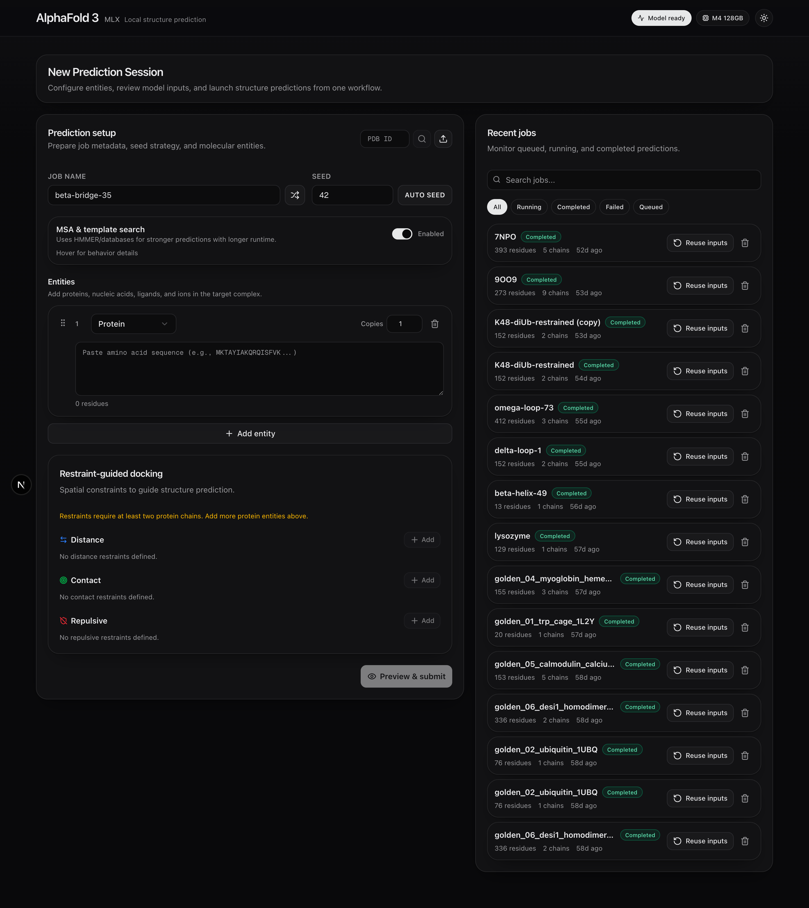
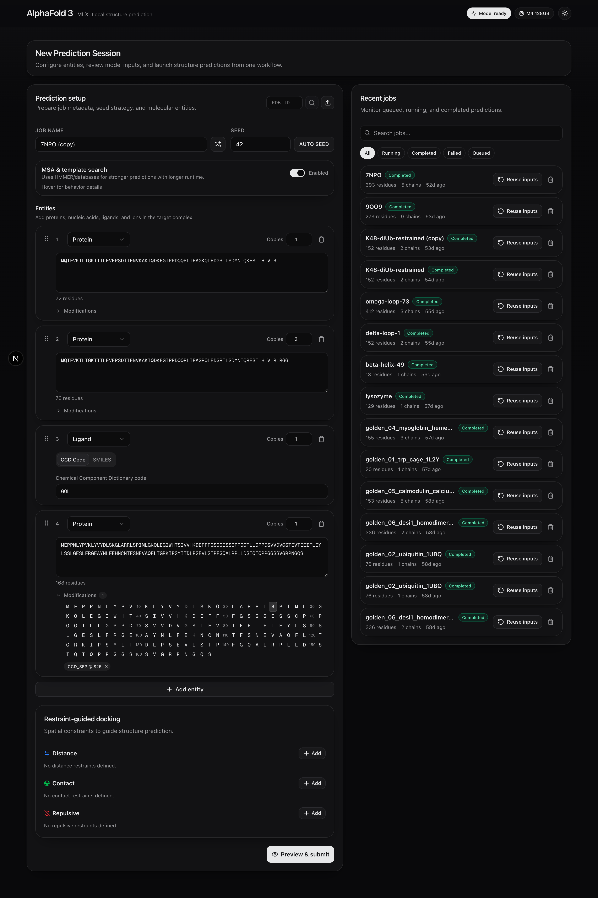
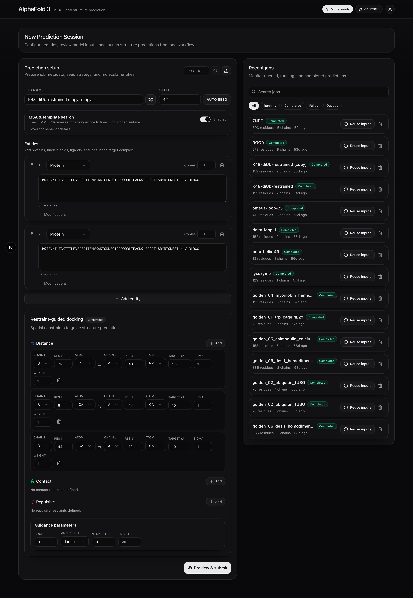

# AlphaFold 3 for Mac

Run [AlphaFold 3](https://github.com/google-deepmind/alphafold3) protein
structure prediction natively on Apple Silicon Macs. The model inference layer
is rewritten in Apple's [MLX](https://github.com/ml-explore/mlx) framework
while the data pipeline and output format remain fully compatible with the
original. No NVIDIA GPU or Linux required.

<p align="center">
  
</p>

## Features

### Predict and visualize in the browser

Submit jobs, track real-time progress, and explore results -- all from a local
web interface. The 3D viewer ([Mol\*](https://molstar.org)) lets you rotate,
zoom, and inspect the predicted structure interactively.

<p align="center">
  
</p>

### Build complex inputs visually

Define multi-chain complexes with proteins, nucleic acids, ligands, and ions.
Paste sequences, look up PDB entries, add post-translational modifications per
residue, or upload existing input files. The entity builder validates input in
real time.

<p align="center">
  
</p>

### Guide docking with restraints

Specify distance, contact, or repulsive restraints between chains to steer the
diffusion process during structure generation. After prediction, a dedicated
satisfaction panel reports which restraints were met and which were violated.

<p align="center">
  
</p>

### Analyze confidence at every level

Results include per-residue confidence (pLDDT), predicted aligned error (PAE),
global fold confidence (pTM), and interface confidence (ipTM) for multi-chain
complexes. Multi-sample ranking helps you pick the best prediction.

<p align="center">
  
</p>

### More highlights

- **Native Apple Silicon** -- M1 through M4 (Max and Ultra) with unified memory
- **CLI** -- single-command predictions from the terminal
- **MSA caching** -- content-addressed cache skips redundant HMMER searches
- **Sequence-only mode** -- run without genetic databases when they are
  unavailable
- **REST API** -- programmatic access for automation and pipelines

## Supported Hardware

Requires an Apple Silicon Mac with a **Max** or **Ultra** chip (M1 through M4).
Minimum **36 GB unified memory** recommended. Larger proteins and multi-chain
complexes require more RAM -- as a rough guide, a single-chain protein of ~500
residues fits comfortably in 64 GB, while complexes with thousands of residues
benefit from 128 GB or more.

## Quick Start

### 1. Install

```bash
git clone https://github.com/omrikais/alphafold3-mac.git
cd alphafold3-mac
./scripts/install.sh
```

The interactive installer sets up Python, MLX, HMMER, the web UI, and
optionally downloads genetic databases (~500 GB). See the full
[Installation guide](docs/getting-started/installation.md) for details.

### 2. Obtain model weights

Request access to the AlphaFold 3 model parameters from Google DeepMind via
[this form](https://forms.gle/svvpY4u2jsHEwWYS6). Place the downloaded
`af3.bin.zst` in the weights directory configured during installation (default
`~/.alphafold3/weights/model/`).

### 3. Run a prediction

**Web interface:**

```bash
./scripts/start.sh
# Open http://127.0.0.1:8642
```

**CLI:**

```bash
source .venv/bin/activate
PYTHONPATH=src python3 run_alphafold_mlx.py \
  --input examples/desi1_monomer.json \
  --output_dir output/my_prediction
```

## Documentation

Browse the full documentation at
**[omrikais.github.io/alphafold3-mac](https://omrikais.github.io/alphafold3-mac/)**,
or read the Markdown sources directly in the [`docs/`](docs/) directory.

Key pages:

- [Quickstart](docs/getting-started/quickstart.md)
- [Input Format](docs/user-guide/input-format.md)
- [Output Format](docs/user-guide/output-format.md)
- [Web Interface](docs/user-guide/web-interface.md)
- [Restraint-Guided Docking](docs/user-guide/restraint-guided-docking.md)
- [CLI Reference](docs/reference/cli.md)
- [API Reference](docs/reference/api.md)
- [Performance Tuning](docs/user-guide/performance.md)
- [Troubleshooting](docs/user-guide/troubleshooting.md)

## Architecture

```
Web UI + REST API          Next.js 15 + FastAPI
        |
Data Pipeline (unchanged) HMMER / MSA / Templates
        |
Model Inference (MLX)      Evoformer -> Diffusion -> Confidence
        |
Post-processing            mmCIF output, confidence scores
```

The original `src/alphafold3/` data pipeline is preserved. Model inference lives
in `src/alphafold3_mlx/` and runs entirely on Apple GPU via MLX.

## Citing This Work

Any publication that discloses findings arising from using this source code, the
model parameters, or outputs produced by those should cite:

> Abramson, J. et al. "Accurate structure prediction of biomolecular
> interactions with AlphaFold 3." *Nature* **630**, 493--500 (2024).
> [doi:10.1038/s41586-024-07487-w](https://doi.org/10.1038/s41586-024-07487-w)

<details>
<summary>BibTeX</summary>

```bibtex
@article{Abramson2024,
  author  = {Abramson, Josh and Adler, Jonas and Dunger, Jack and others},
  title   = {Accurate structure prediction of biomolecular interactions
             with {AlphaFold} 3},
  journal = {Nature},
  year    = {2024},
  volume  = {630},
  number  = {8016},
  pages   = {493--500},
  doi     = {10.1038/s41586-024-07487-w}
}
```

</details>

## License

The AlphaFold 3 source code is licensed under
[CC-BY-NC-SA 4.0](LICENSE).
Model parameters are subject to the
[AlphaFold 3 Model Parameters Terms of Use](https://github.com/google-deepmind/alphafold3/blob/main/WEIGHTS_TERMS_OF_USE.md).

Based on [AlphaFold 3](https://github.com/google-deepmind/alphafold3) by
Google DeepMind. This is not an officially supported Google product.
